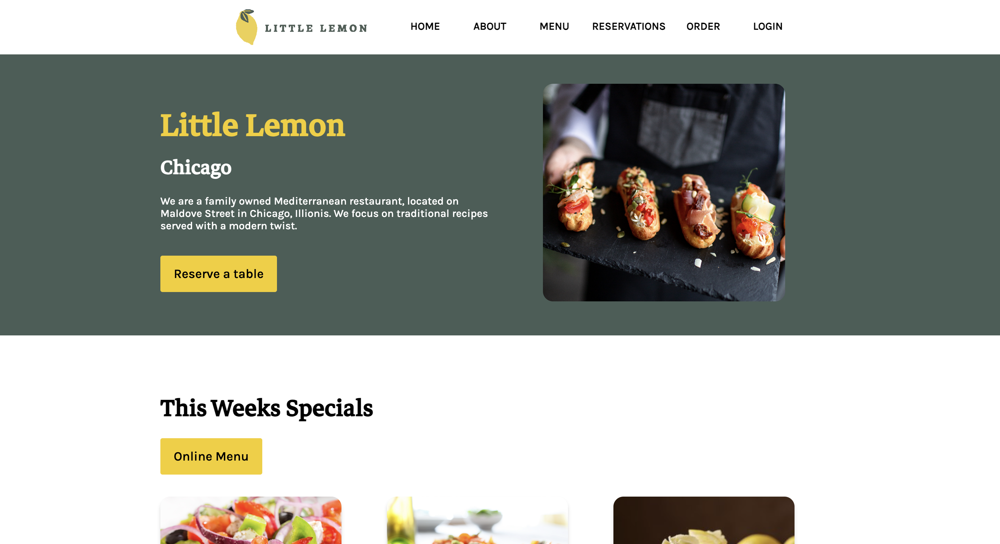
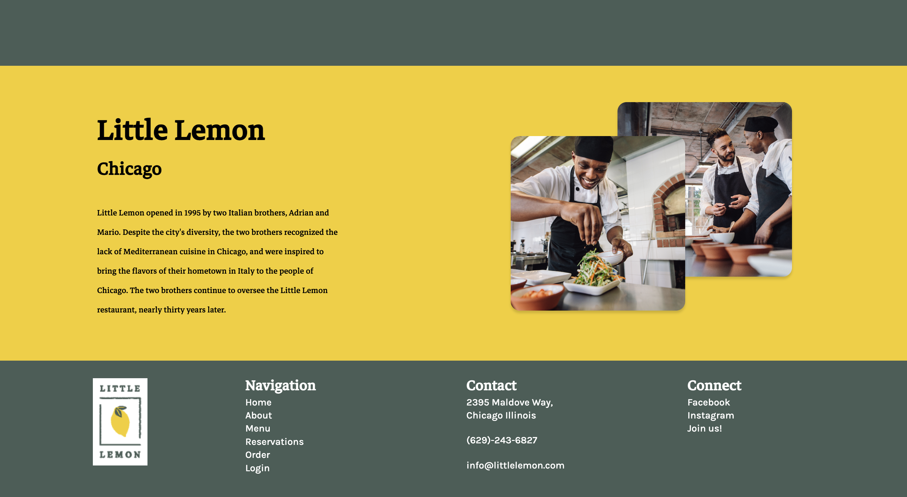
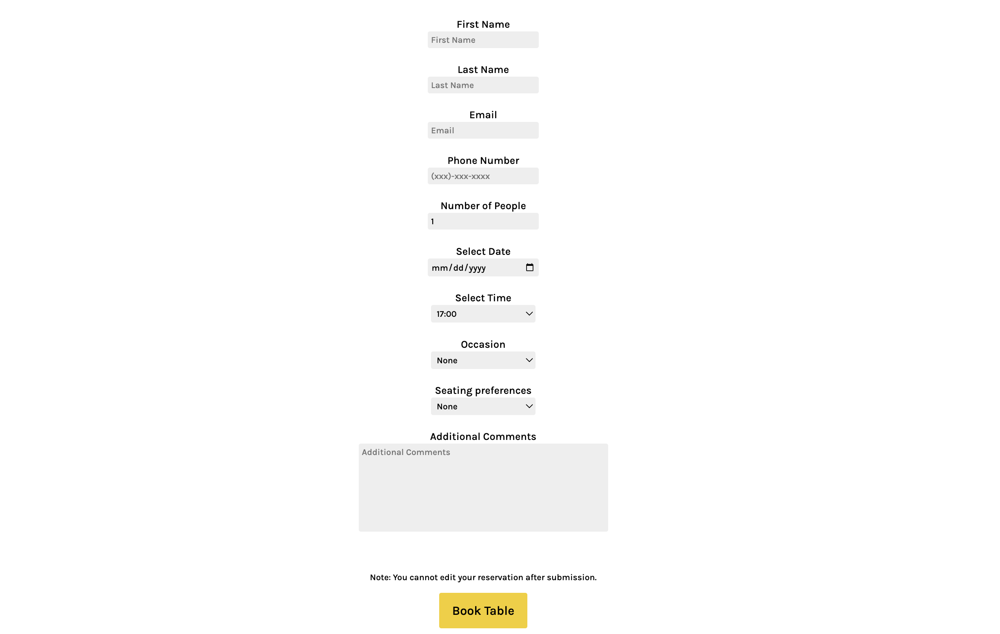

# Little Lemon Restaurant

Final capstone project for Meta front-end developer course on Coursera.

Course Link - [Meta Front-End Developer Professional Certificate](https://www.coursera.org/professional-certificates/meta-front-end-developer)

## Screenshot

### Home Page

### About us

### Booking Page

### Third Party Libraries & APIs:

- react-router-dom
- react-responsive-carousel
- Meta front-end table-booking API

### Author

- Bennett Zink
